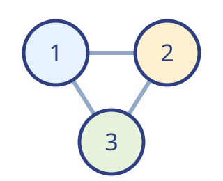
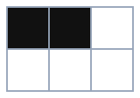
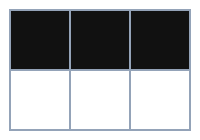
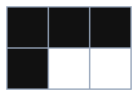
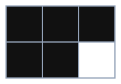

## Willkommen {fragments="off"}

Diese Präsentation führt durch die Bausteine und Werkzeuge der Extension.

- **→** zeigt den nächsten Inhalt oder die nächste Folie.
- Das **Menü mit den drei Punkten** öffnet weitere Werkzeuge.
- **Enter** beendet eine Auswahl oder einen Modus. **?** zeigt die Tastaturhilfe.

Öffne parallel diese QMD: Jedes Beispiel zeigt dort seine Schreibweise.

## Schritt für Schritt

Dieser Absatz erscheint zuerst.

- Danach kommt der erste Hauptpunkt.
  - Nun folgt dieser Unterpunkt.
  - Und anschließend dieser.
- Zuletzt erscheint der zweite Hauptpunkt.

::: {.notes}
Automatische Einblendungen werden im Projekt-YAML mit presentation.fragments gesteuert.
Die Überschrift steht schon zu Beginn. Haupt- und Unterpunkte folgen einzeln.
:::

## Den Ablauf selbst bestimmen {fragments="off"}

Dieser Absatz ist sofort sichtbar.

[Dieser Satz erscheint erst beim nächsten Klick.]{.fragment}

::: {.statement .fragment}
Eine ganze Box kann zusammen eingeblendet werden.
:::

::: {.notes}
fragments="off" schaltet nur die Automatik aus. Manuelle .fragment-Angaben bleiben wirksam.
fragments="together" an einem Block zeigt dessen Inhalt gemeinsam.
:::

## Text und Bild nebeneinander

::: {.columns}
::: {.column width="60%"}
- **Fett** betont einen Begriff.
- *Kursiv* setzt einen Akzent.
- `Code` hebt eine Eingabe hervor.

| Schritt | Ziel |
| --- | --- |
| 1 | Idee finden |
| 2 | Beispiel zeigen |
| 3 | Gemeinsam prüfen |
:::
::: {.column width="40%"}
{width="300"}
:::
:::

## Wichtiges hervorheben

Eine gute Folie hat [eine klare Aussage]{.rn-fragment rn-type=underline rn-color="#3873b8"}.

Ein [Beispiel]{.rn-fragment rn-type=circle rn-color="#3873b8"} macht sie anschaulich.

[Wichtige Begriffe]{.rn-fragment rn-type=highlight rn-color="#ffcc0066"} lassen sich farbig markieren.

::: {.notes}
Die Markierungen werden beim Weiterklicken gezeichnet. Hier werden Unterstreichen,
Einkreisen und Hervorheben mit Rough Notation gezeigt.
:::

## Aufgaben mit Titel, Icon und Zeit

::: {.task title="Ideen sammeln" time="3" icon="discussion"}
- Überlegt euch zu zweit ein Thema.
- Notiert drei Gedanken, die ihr vermitteln möchtet.
:::

::: {.task title="Ein Beispiel finden" time="2" icon="computer" fragments="together"}
Sucht am Computer ein passendes Beispiel für eure Idee.
:::

::: {.notes}
Weitere Icons: pencil, book und group. Titel, Icon und Zeit sind optional.
Die Zeit ist eine Beschriftung, kein Countdown. Eine Zahl erhält automatisch „min“.
:::

## Platz zum Arbeiten {fragments="off"}

::: {.task title="Eine Skizze entwickeln" time="5" icon="pencil" height="fill"}
Öffne mit **C** den Zeichenmodus und skizziere deine Idee im freien Bereich.
:::

::: {.notes}
height="fill" verlängert die letzte Aufgabenbox bis zum unteren Inhaltsrand.
Mit Enter den Zeichenmodus wieder verlassen.
:::

## Bilder gezielt einbinden

::: {.image src="assets/ideen.svg" alt="Drei verbundene Gedanken" width="38%" align="center"}
:::

Das Bild bleibt proportional. Breite und Ausrichtung stehen direkt am Block.

## Medien frei anordnen {fragments="off"}

Öffne **Medien positionieren** im Menü oder drücke **V**.
Verschiebe die Bilder zur Mitte: Hilfslinien helfen beim Ausrichten.

::: {.image src="assets/ideen.svg" alt="Verbundene Gedanken" position="free" x="12%" y="38%" width="25%" rotation="-8" layer="1"}
:::

::: {.image src="assets/logo.svg" alt="Beispiellogo" position="free" x="64%" y="40%" width="17%" transparency="15" layer="2"}
:::

::: {.notes}
Wähle ein Bild: Größe, Ebene, Drehung und Transparenz sind veränderbar.
Alt unterdrückt das Einrasten. Enter hebt zuerst die Auswahl auf und beendet dann den Modus.
Über „Im Quarto-Dokument speichern“ werden die Platzierungen dauerhaft übernommen.
:::

## Die Medienbibliothek {fragments="off"}

1. Öffne **Medienbibliothek** im Menü.
2. Wähle ein Bild, ein GIF oder das Beispielvideo aus.
3. Positioniere es auf der Folie.

Du kannst auch eine Bilddatei auf die Folie ziehen oder ein kopiertes Bild
mit **Cmd/Ctrl+V** einfügen.

::: {.notes}
Die Dateien dieses Rundgangs liegen in assets. Bei Stunden in Unterordnern
kommen deren eigene assets hinzu. Platzierungen erst mit „Im Quarto-Dokument speichern“
ins QMD übernehmen. Dafür die laufende Quarto-Vorschau verwenden.
:::

## Bewegung mit GIFs {fragments="off"}

::: {.image src="assets/bewegung.gif" alt="Ein Punkt wandert von links nach rechts" width="65%"}
:::

GIFs können direkt eingebunden oder aus der Bibliothek frei platziert werden.

## Ein lokales Video {fragments="off"}

::: {.video src="assets/farben.mp4" title="Farben in Bewegung" width="68%"}
:::

Starte das Video und teste Lautstärke, Zeitleiste und Vollbild.
Dieses kurze Beispiel hat keine Tonspur.

## Ein Video aus dem Netz {fragments="off"}

::: {.video src="https://www.youtube.com/watch?v=NebvhMY9DU4" title="Video zu RGB" width="65%"}
:::

Online-Videos benötigen Internet und die Freigabe des Anbieters.
Du kannst auch einen direkten Link zu einer MP4-Datei verwenden.

## Ein Dokument auf der Folie {fragments="off"}

::: {.document src="assets/arbeitsblatt.pdf" title="Ideenblatt" height="fill"}
:::

::: {.notes}
Scrolle im PDF und probiere die Zoomsteuerung aus. „Separat öffnen“ nutzt den
Browser-Viewer. Ohne title erscheint der Dateiname. Die Vorschau unterstützt PDFs;
für andere Dokumente einen normalen Downloadlink verwenden.
:::

## Ein interaktives HTML-Element {fragments="off"}

::: {.embed src="assets/raster.html" title="Klickbares Raster" height="fill"}
:::

::: {.notes}
Klicke Zellen an: Sie wechseln zwischen hell und dunkel. Das HTML liegt als eigene
Datei in assets. Der Folientext bleibt dadurch übersichtlich. Der Zustand dieses
Beispiel-Widgets wird nicht in der QMD oder im Sitzungsexport gespeichert.
:::

## Quiz zum Ausprobieren {.quiz-intro subtitle="Fünf kurze Beispiele"}

## Eine richtige Antwort {.quiz-question}

Welche Taste öffnet die Tafel?

- C
- [B]{.correct}
- V

## Mehrere richtige Antworten {.quiz-question type="multiple" columns="2"}

Welche dieser Dateien kann die Medienbibliothek anbieten?

- [Bilder]{.correct}
- [GIFs]{.correct}
- [Lokale Videos]{.correct}
- Tabellen als bearbeitbare Excel-Arbeitsmappe

## Bilder als Antworten {.quiz-question answers="images"}

Welches Raster hat genau **drei** dunkle Felder?

- 
- []{.correct}
- 
- 

## Platz für ein Fragebild {.quiz-question layout="image" columns="2"}

Wie viele nummerierte Kreise zeigt das Bild?

::: {.image src="assets/ideen.svg" alt="Verbundene nummerierte Kreise" position="free" x="40%" y="22%" width="20%"}
:::

- Zwei
- [Drei]{.correct}
- Vier
- Fünf

::: {.notes}
layout="image" richtet die Antworten unten aus. Der übrige Bereich bleibt für
manuell platzierte Bilder frei. Dieses Bild ist bereits als Beispiel platziert.
:::

## Begriffe zuordnen {.quiz-question type="cloze"}

Mit [C]{.answer} öffne ich den Zeichenmodus.
Mit [B]{.answer} öffne ich die Tafel.
Mit [Enter]{.answer} verlasse ich einen Modus.

::: {.notes}
Die Begriffe aus dem Auswahlfeld in die Lücken ziehen und dann „Prüfen“ drücken.
Nur die vollständig richtige Zuordnung erhält die volle Punktzahl.
:::

## Unser Ergebnis {.quiz-results show="both"}

::: {.notes}
show="both" zeigt Gesamtpunktzahl und einzelne Fragen. show="total" zeigt nur
die Gesamtpunktzahl; show="questions" nur die Fragenübersicht.
:::

## Zeichnen und Tafel {fragments="off"}

- **C:** Markiere etwas direkt auf dieser Folie.
- **B:** Öffne eine Tafel für eine freie Skizze.
- Probiere Stift und Radierer in der Werkzeugleiste aus.
- Zeichne eine Linie oder einen Kreis und halte am Ende kurz still.
- **Enter:** Kehre zur Präsentation zurück.

::: {.statement}
Was unterscheidet eine gute Idee von einer verständlichen Erklärung?
:::

## Zeigen, suchen und navigieren {fragments="off"}

Öffne im Menü **Modi** und probiere nacheinander aus:

- **Laserpointer** und **Lupe** zum Zeigen und Vergrößern.
- **Suche:** Suche nach „Idee“; ein Klick auf die Folie beendet die Suche.
- **Folienübersicht:** Springe direkt zu einer Folie.
- **Vollbild**, **Referentenansicht** und **Abdunkeln** für den Vortrag.

Die Tastaturhilfe **?** zeigt die zugehörigen Kürzel.

::: {.notes}
Hier steht eine Notiz nur für die Referentenansicht. Sie erscheint nicht auf der Folie.
Die Verblassdauer des Laserpointers wird im Projekt-YAML in Sekunden eingestellt.
:::

## Python direkt ausprobieren {fragments="off"}

Öffne mit **T** die Python-Konsole und führe diesen Code dort aus:

```python
zahlen = [1, 2, 3, 4]
print(sum(zahlen))
```

Ergebnis: **10**. Mit **Enter** verlässt du den Modus, wenn kein Eingabefeld aktiv ist.

::: {.notes}
Die Python-Laufzeit lädt beim ersten Öffnen im Browser und benötigt dafür Internet.
Grafiken und Dateien erscheinen über die Ausgabeansicht. Der Kernelzustand wird
nicht in einen Sitzungsexport übernommen. Der Codeblock auf der Folie wird nicht
beim Rendern ausgeführt.
:::

## Speichern, exportieren, zurücksetzen {fragments="off"}

Öffne im Menü **Extras**:

- **Im Quarto-Dokument speichern:** platzierte Medien dauerhaft übernehmen.
- **Folien als PDF exportieren:** den gewünschten Folien- und Zeichnungsstand wählen.
- **Tafel als PDF exportieren:** beschriebene Tafelseiten sichern.
- **Präsentation exportieren:** HTML, Medien und Sitzung als ZIP weitergeben.
- **Sitzung zurücksetzen:** Quiz, Zeichnungen und Platzierungen neu beginnen.

Teste das Zurücksetzen erst, wenn du alles Nötige gespeichert hast.

## Jetzt deine eigene Präsentation {fragments="off"}

1. Ersetze Titel und Inhalte dieser QMD.
2. Passe Name, Schule, Kopfzeile und Logo in `_quarto.yml` an.
3. Lege eigene Medien in `assets/` ab.
4. Entferne die Beispielfolien, die du nicht brauchst.

Alle Beispiele bleiben als kopierbare Bausteine in dieser Datei nachvollziehbar.
